# Birdy – Visuelle Politur

Ziel: Jeder Bildschirm soll wie ein fertiges, professionell gestaltetes Mobile-Game aussehen.
Jeder Bereich der Scorecard soll laut einem unabhängigen Art-Director-Review mindestens 8/10
erreichen. Die Reviews sehen nur Screenshots, keinen Code.

**Werkzeuge:**
- `scripts/catalog.mjs` erzeugt den Screenshot-Katalog: 34 Zustände je Sprache (DE/EN) und
  Größe (360×640, 390×844). Der Zufall ist gesät, und die Spielzeit läuft ohne Zeichnen vor.
  Dadurch zeigen zwei Builds dieselben Szenen.
- `scripts/render-assets.mjs` rendert Icon, Splash und Feature-Grafiken aus dem Spielvogel.
- `SEED=7 node scripts/playtest.mjs 50` lässt den Bot 50 Runs je Stufe spielen, mit gesätem
  Zufall.
- `scripts/perf.mjs` misst Draw Calls, Dreiecke und die Zeit bis zum ersten Frame (headless).

**Messbasis vor Iteration 1:**
- Build: `main` plus Test-Hook. Median aus 3 Messungen, headless SwiftShader.
- Erster Frame 652 ms. Budget: höchstens +20 %, also ≤ 782 ms.
- 138 Draw Calls (Budget 170), 41,5 k Dreiecke (Budget 90 k).
- Playtest mit `SEED=7`, 50 Runs je Stufe:

  | Stufe | Median Zeit | Median Punkte | Münzen/Run | Zonen 2/3/4 |
  |---|---|---|---|---|---|---|---|---|
  | Anfänger | 17,4 s | 9 | 8 | 46 / 2 / 0 % |
  | Geübt | 40,2 s | 23 | 23 | 100 / 64 / 22 % |
  | Profi | 180 s (Zeitlimit) | 144 | 138 | 100 / 100 / 100 % |

## Visual-Scorecard

| # | Bereich | Review 0 (Start) | Review 1 (nach It. 3) | Review 2 (nach It. 6) | Review 3 (nach It. 10) | Review 4 (nach It. 13) |
|---|---|---|
| 1 | Vogel & Kosmetik | 6 | 5 | 6 | 5 | 6 |
| 2 | Welten & Szenerie | 6 | 6 | 6 | 6 | 6 |
| 3 | Hindernisse & Pickups | 5 | 4 | 4 | 5 | 5 |
| 4 | Licht, Farbe & Atmosphäre | 6 | 6 | 6 | 6 | 6 |
| 5 | UI-System | 6 | 6 | 6 | 6 | 6 |
| 6 | Typografie & Icons | 4 | 5 | 5 | 5 | 5 |
| 7 | Effekte & Partikel | 4 | 4 | 5 | 4 | 5 |
| 8 | Animation & Übergänge | 5 | 5 | 5 | 5 | 5 |
| 9 | Lesbarkeit im Spiel | 5 | 5 | 5 | 5 | 5 |
| 10 | Store-Assets | 3 | 4 | 4 | 6 | 6 |
| | **Schnitt** | **5,0** | **5,0** | **5,2** | **5,3** | **5,5** |

Begründungen aus Review 0 (Art-Director-Subagent, nur Screenshots):

1. **Vogel & Kosmetik (6):** In der Seitenansicht im Shop wirkt der Vogel charmant. Von hinten
   und von vorn ist er eine gelbe Facettenkugel mit blassen, stäbchenartigen Flügeln. Die
   Vorschaubilder sind klein, und gesperrte Artikel lassen sich schlecht unterscheiden.
2. **Welten & Szenerie (6):** Jede Zone hat eine eigene Palette und eigene Props. Weg, Röhren
   und Randstreifen sind aber überall gleich. Die Stadt besteht aus grauen Quadern.
3. **Hindernisse & Pickups (5):** Die Röhren blenden nach oben zu „Lichtsäulen“ aus. Die Münzen
   sind flache Scheiben. Power-up-Blasen sind in der Ferne winzig, der Kaktus ist schwer zu
   erkennen.
4. **Licht, Farbe & Atmosphäre (6):** Die Himmel je Zone sind stimmig. Es gibt nur
   Blob-Schatten, der Horizont ist flach. In der Candy-Welt beißen sich grüne Röhren mit Rosa.
5. **UI-System (6):** Die Panels sind konsistent: Creme, Plum-Outline, 3D-Kante. Listen werden
   abgeschnitten, das Unlock-Banner ragt über den Rand, und Game Over ist in EN 390 verrutscht.
6. **Typografie & Icons (4):** Zwei Schriften stehen nebeneinander (Lilita One und
   System-Grotesk). Als Icons dient ein Emoji-Mischmasch.
7. **Effekte & Partikel (4):** Die Trails sind einfache Punkte. Das Regenbogen-Power-up färbt den
   Vogel nur. Der Magnet ist unsichtbar, und beim Crash gibt es keinen Treffer-Effekt.
8. **Animation & Übergänge (5):** Aus Standbildern abgeleitet: Hinter Pause und Game Over wird
   nicht abgedunkelt. Der Crash-Frame sieht aus wie das normale Spiel.
9. **Lesbarkeit im Spiel (5):** Nahe, schon passierte Röhren und Münzen erscheinen als große
   halbtransparente Geister vor der Kamera. Toasts und Banner liegen auf den Hindernissen.
10. **Store-Assets (3):** Der Splash zeigt noch „Flapsy“. Die Store-Screenshots sind rohe
    Spielbilder ohne Rahmen und Claim.

Katalog-Übersichten (Start): `docs/visual/base/*.jpg`

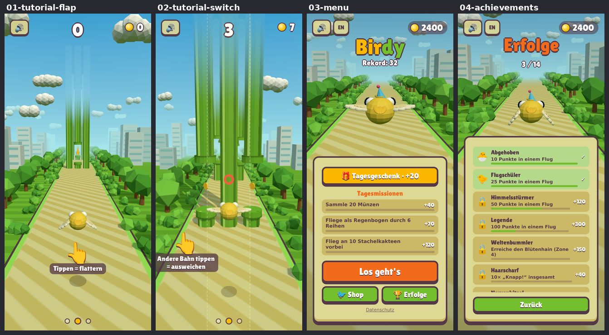
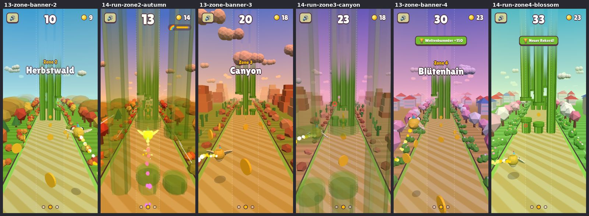
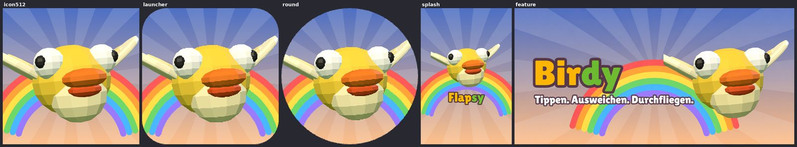

## Mängelliste (priorisiert, Stand Review 0)

Status: offen / ✅ erledigt (Iteration) / ⏸ wartet auf Entscheidung.

| # | Bereich | Schwere | Mangel | Plan | Status |
|---|---|---|---|---|---|
| 1 | 10 | Blocker | Der Splash zeigt „Flapsy“ statt „Birdy“. | Splash neu rendern mit dem Birdy-Schriftzug | ✅ It. 1 |
| 2 | 5 | Blocker | Game Over in EN 390×844 ist nach oben verrutscht, unten erscheint ein türkiser Streifen. Ursache: Der App-Container scrollt (`scrollIntoView`). | Container gegen Scrollen sperren, nur die Liste scrollen lassen | ✅ It. 3 |
| 3 | 10 | ~~Blocker~~ | ~~Schwarze Ecken am runden Launcher-Icon~~ | Geprüft: Die Icons sind transparent. Das Schwarz kam vom Übersichtsbild-Werkzeug. Die gezackte Kante wird beim Neurendern mit geglättet. | – |
| 4 | 9 | hoch | Passierte Röhren und Münzen erscheinen als riesige halbtransparente Geister vor der Kamera und verdecken den Vogel. | Schneller und vollständig ausblenden, sobald sie hinter dem Vogel sind | ✅ It. 2 |
| 5 | 10 | hoch | Store-Screenshots ohne Rahmen, Hintergrund und Claim. | Gestaltete Screens DE/EN mit Claim | ✅ It. 8 |
| 6 | 6 | hoch | Emoji als Icons: Shop-Reiter, Schlösser, Toasts, Hand, Ton, Geschenk. | Eigenes SVG-Icon-Set | ⏸ Varianten zur Wahl |
| 7 | 6 | hoch | Fließtexte in System-Schrift statt Hausschrift. | Einheitliche Schrift | ⏸ Varianten zur Wahl |
| 8 | 7/8 | hoch | Beim Crash ist keine Rückmeldung sichtbar. | Treffer-Stern, Federn, Flash, Squash | ✅ It. 4 |
| 9 | 3 | hoch | Die Röhren blenden nach oben zu „grünen Lichtsäulen“ aus. | Röhren oben sauber enden lassen oder in den Himmel ausblenden | ✅ It. 5 (Wolkenbank) |
| 10 | 2/3 | hoch | Alle Kaufwelten haben denselben beigen Weg und denselben Rand. | Weg-Palette je Welt | ⏸ Farbwelt (Rückfrage) |
| 11 | 3 | hoch | Der Kaktus ist nicht erkennbar, Power-up-Blasen sind in der Ferne winzig. | Silhouette, Kontrast, Halo | ✅ It. 6 |
| 12 | 1 | mittel | Die Flügel sind blass und stäbchenartig. | Flügel in Körpernähe kräftiger | ⏸ Vogel (Rückfrage) |
| 13 | 1 | mittel | Von hinten ist der Vogel eine Kugel. | Scheitelbüschel und Schwanz lesbarer | ⏸ Vogel (Rückfrage) |
| 14 | 1/5 | mittel | Shop-Vorschaubilder sind klein; gesperrte Artikel sind schlecht erkennbar. | Größere Kacheln, Preisleiste, gesperrte Artikel entsättigen | offen |
| 15 | 5 | mittel | Listen enden mitten in einer Zeile, ohne Scroll-Hinweis. | Fade-Masken, ganze Zeilen | ✅ It. 3 (Fade) |
| 16 | 5 | mittel | Das Unlock-Banner ragt über den Panelrand (360 px). | In Panelbreite halten, Text kürzen | ✅ It. 3 |
| 17 | 9 | mittel | Die gestrichelten Spurlinien laufen durch Himmel und HUD. | Linien nur auf dem Boden | ✅ It. 7 |
| 18 | 8 | mittel | Get-Ready-Pfeile bleiben halbtransparent stehen; „hierhin“ sagt wenig. | Sauber ausblenden, Text „Spur wechseln“ | offen |
| 19 | 5/8 | mittel | Pause und Game Over dunkeln das Spiel nicht ab. | Scrim und Scale-In | ✅ It. 3 (Scrim) |
| 20 | 9 | mittel | Toasts und Zonenbanner liegen auf den Hindernissen. | Toast kompakt unter dem HUD, Banner kürzer und höher | offen |
| 21 | 2 | mittel | Die Stadt besteht aus grauen Quadern, die im Shop riesig wirken. | Fenster, Dächer, Pastelltöne | offen |
| 22 | 7 | mittel | Das Regenbogen-Power-up zeigt nur Farbe, der Magnet ist unsichtbar, die Speed-Lines sind schwach. | Regenbogen-Band, Magnet-Ring, kräftigere Linien | ✅ It. 10 (Aura, Linien) |
| 23 | 3 | niedrig | Münzen ohne Rand und Prägung. | Rand und Prägung, Glanz | offen |
| 24 | 10 | niedrig | Im Icon ist der Vogel angeschnitten, der Schnabel wirkt wie Lippen. | Vogel vollständig, mit Outline | ✅ It. 1 |
| 25 | 10 | niedrig | Die Feature-Grafik ist leer, und das Logo ist anders gefärbt als im Menü. | Logo wie im Menü, Vogel vollständig | ✅ It. 1 |
| 26 | 4 | niedrig | Nur Blob-Schatten; der Horizont ist flach. | Kontaktschatten unter Röhren, Horizont staffeln | offen |
| 27 | 5 | niedrig | Die Spurpunkte unten wirken wie ein Karussell. | Spuranzeige neu | ✅ It. 7 |
| 28 | 6 | niedrig | Das Logo wirkt unausgewogen. | – (Logo bleibt, Markenzeichen) | offen |

## Styleguide

Alle Iterationen richten sich danach. Werte sind CSS-Pixel bei 390 px Breite.

### Farben

| Rolle | Token | Hex |
|---|---|---|
| Outline, Textschatten, dunkle Schrift | `--ink` | `#543847` (Plum) |
| Panel-Fläche | `--panel` | `#f4ebc4` (wärmer als bisher `#ded895`) |
| Karte im Panel (Missionen, Kacheln) | `--card` | `#e6d9a2` |
| Panel-Unterkante (Innenlippe) | `--panel-lip` | `#d9c98a` |
| Primär-Aktion (Los geht's, Nochmal) | `--primary` | `#f26b1d` |
| Kaufen, Geschenk, Highlight | `--gold` | `#fcb800` |
| Sekundär (Zurück, Menü) | `--green` | `#73bf2e` |
| Erledigt / Erfolg | `--done` | `#b5d98a` |
| Akzent Überraschung / Zufall | `--violet` | `#7b6bd6` |
| HUD-Pille (Münzen, Power-ups) | `--pill` | `rgba(84, 56, 71, 0.55)` |
| Scrim hinter Overlays | `--scrim` | `rgba(43, 30, 46, 0.45)` |
| Himmel/Logo | – | Gelb `#fcb800`, Grün `#73bf2e` wie im Menü-Titel |

Spielobjekte behalten ihre Signalfarben: Röhre grün `#73bf2e`, Münze gold `#ffcf33`, Kaktus
türkis `#2fa58f` mit cremefarbenen Stacheln.

### Formen

- **Radien:** 6 px (Tabs, kleine Chips), 10 px (Buttons, Karten, Toast), 16 px (Panels),
  voll rund (Pillen, Punkte).
- **Outline:** 3 px für Panels und alles Klickbare, 2 px für Kacheln, Karten und Icons.
- **3D-Kante:** Nur klickbare Elemente haben eine Unterkante in `--ink`: 5 px bei großen
  Buttons, 3 px bei kleinen. Toasts, Banner und Pillen sind flach.
- **Raster:** Abstände in Vielfachen von 4 px (4 / 8 / 12 / 16 / 24). Panel-Innenabstand 16 px.

### Schrift

- **Display:** Lilita One für Titel, Zahlen, Buttons und Banner, mit Plum-Outline über
  Textschatten.
- **Größen:**
  - Logo 56
  - Titel 44
  - Zonenbanner 40 / 20
  - Score 48–80
  - Button L 26, Button M 20
  - Body 14
  - Caption 11–12
- **Body-Schrift:** Wird in einer Iteration vereinheitlicht (siehe Rückfrage). Bis dahin gilt:
  keine neuen Stellen mit System-Schrift.

### Icons

- Eigene SVG-Icons statt Emoji. Stilvarianten werden zur Wahl gestellt.
- Vorgabe:
  - 24er-Raster, 2 px Plum-Outline
  - flache Füllung aus der Palette, höchstens 2 Töne plus Glanzpunkt
  - runde Linienenden
- Größen:
  - 20 px in Reitern und Buttons
  - 24 px in Listen
  - 56 px für die Tutorial-Hand
- Münze: überall dieselbe Münze wie im HUD, also Gold mit Plum-Rand.

### 3D

- Low-Poly mit Flat Shading, helle Töne.
- Neue Objekte:
  - backen, damit sie einen Draw Call pro Gruppe brauchen
  - keine Texturen außer generierten
  - Vertex-Farben aus der Palette der Zone
- Durchsichtigkeit nur für kurze Ausblendungen, nie als dauerhafter Zustand im Bild.

## Iterationen

Jede Iteration behebt die größte sichtbare Schwäche und wird so belegt:
- Vorher/Nachher-Bild derselben Szene
- Playtest mit 50 Runs je Stufe
- Perf-Messung
- APK-Build

### Iteration 1 – Store-Assets: Splash, Launcher-Icons, Feature-Grafik (Bereich 10)

**Warum:** Der Splash zeigte beim Start jeder App noch „Flapsy“ (Blocker 1). Bereich 10 war mit
3/10 der schwächste.

**Was:**
- Neues Render-Werkzeug `scripts/render-assets.mjs` (Szene in `scripts/assets/`). Es rendert
  den echten Spielvogel und legt alles in 2D zusammen:
  - Himmelsverlauf, Sonnenstrahlen, Regenbogen und Wolken mit Plum-Kontur wie in der UI
  - „Birdy“-Schriftzug in Lilita One, Farben wie im Menü
- Vogel:
  - leicht von oben, Flügel halb gehoben, damit man ihre Fläche sieht statt „Stäbchen“
  - vollständig im Bild, mit Aufkleber-Kontur für die Lesbarkeit bei 48 px
- Neu gerendert:
  - Launcher-Icons (Legacy eckig und rund mit geglätteten Kanten)
  - adaptive Ebenen: Vogel im sicheren Bereich, Hintergrund mit Regenbogen
  - Splash hoch und quer: Regenbogen auf zwei Wolken, Vogel, Schriftzug „Birdy“
  - Store-Icon 512
  - Feature-Grafik DE, neu auch EN („Tap. Dodge. Fly through.“)
- Splash als WebP statt PNG, denn die Verläufe hätten die APK um 4,6 MB vergrößert. Die APK bleibt
  bei 7,2 MB.
- Die Hintergrundfarbe des Android-12-Splashs passt jetzt zum neuen Himmel (`#5AA9E6`).

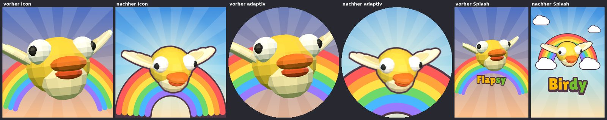
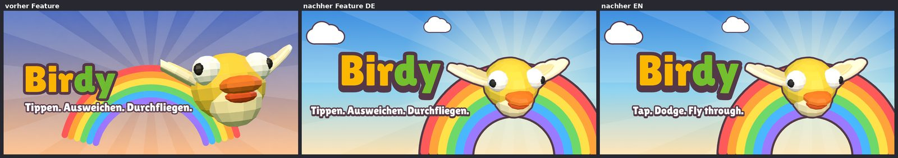

**Messwerte:**
- Playtest (`SEED=7`, 50 Runs je Stufe): identisch mit der Basis. Anfänger 17,4 s / 9 Punkte,
  Geübt 40,2 s / 23, Profi 180 s / 144. Keine Fehler.
- Perf: erster Frame 686 ms (Median aus 3, Budget 782 ms), 130–143 Draw Calls, 42 k Dreiecke.
  Am Spielcode hat sich nichts geändert; die Abweichung zur Basis ist Messrauschen.
- APK baut (7,2 MB).

**Neue Einschätzung:** Store-Assets 3 → 5. Der Blocker ist behoben, Icon und Splash sind
eigenständig und markentreu. Es fehlen noch gestaltete Store-Screenshots mit Rahmen und Claim.

### Iteration 2 – Keine Geisterbilder vor der Kamera (Bereich 9)

**Warum:** Passierte Röhrenreihen blendeten langsam aus und hingen als riesige, halbtransparente
grüne Flächen vor der Kamera. Verpasste Münzen flogen als große Scheiben ins Bild. Beides
verdeckte den Vogel (Mangel 4, „hoch“).

**Was:**
- Eine passierte Reihe verschwindet jetzt über 1,5 Einheiten hinter dem Vogel. Die Deckkraft
  hängt am Abstand statt an der Zeit, bei Spieltempo dauert das etwa 0,06 s.
- Verpasste Münzen und Power-ups schrumpfen 1,5–3 Einheiten hinter dem Vogel auf null.
- Nur die Optik ändert sich: Kollision, Punktevergabe und Magnet laufen wie vorher. Münzen
  bleiben einsammelbar, denn der Magnet kann sie noch zurückziehen.
- Zusätzlich: Der Katalog hält die Echtzeit-Schleife an (`freeze`), damit Vorher/Nachher-Bilder
  exakt dieselbe Szene zeigen.

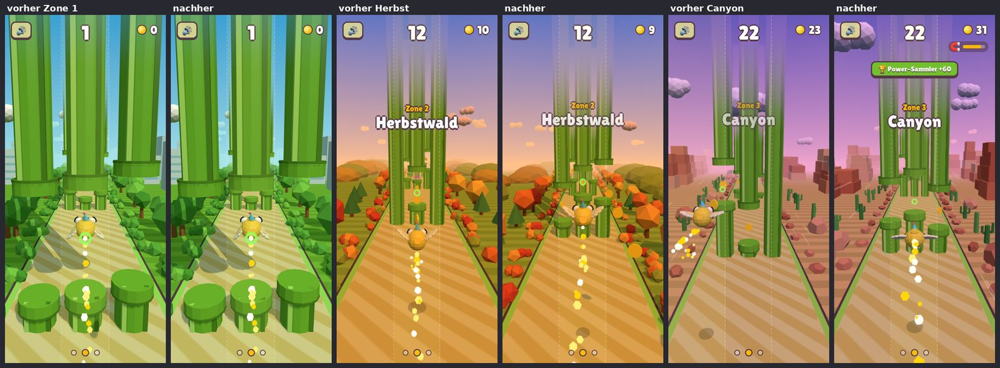

**Messwerte:**
- Playtest (`SEED=7`, 50 Runs je Stufe): Ergebnis für Ergebnis identisch mit der Basis
  (Anfänger 17,4 s / 9 Punkte / 8 Münzen, Geübt 40,2 s / 23 / 23, Profi 180 s / 144 / 138). Damit
  ist belegt, dass die Spiellogik unverändert ist.
- Perf: erster Frame 660 ms (Median, Budget 782), 135–141 Draw Calls, 42 k Dreiecke.
- APK baut.

**Neue Einschätzung:** Lesbarkeit 5 → 6. Offen bleiben Spurlinien im Himmel sowie Toasts und
Banner über den Hindernissen.

### Iteration 3 – UI-Layout: nichts verrutscht, nichts ragt heraus (Bereich 5)

**Warum:**
- Der Game-Over-Screen war bei EN 390×844 nach oben verrutscht: Ton, Sprache und Münzen waren
  abgeschnitten, unten erschien ein türkiser Streifen (Blocker 2).
- Das Unlock-Banner ragte über den Panelrand hinaus.
- Pause und Game Over hoben sich nicht vom Spiel ab.
- Die Erfolgsliste endete mitten in einer Zeile.

**Ursache des Blockers:** `scrollIntoView()` im Shop scrollte nicht nur das Artikel-Raster,
sondern auch den ganzen App-Container. Dieser ist `overflow: hidden`, lässt sich per Skript aber
trotzdem scrollen. Der Versatz blieb bis zum nächsten Bildschirm stehen.

**Was:**
- Das Raster scrollt jetzt gezielt selbst (`reveal`). Der App-Container setzt jede
  Scroll-Verschiebung sofort auf 0 zurück.
- Pause und Game Over liegen auf einem Scrim in Plum (45 %, blendet in 0,25 s ein).
- „Jetzt freischaltbar“ leuchtet, statt auf 112 % zu wachsen, und bleibt so im Panel.
- Die Erfolgsliste blendet unten weich aus, solange weitere Einträge folgen (wie das
  Shop-Raster).

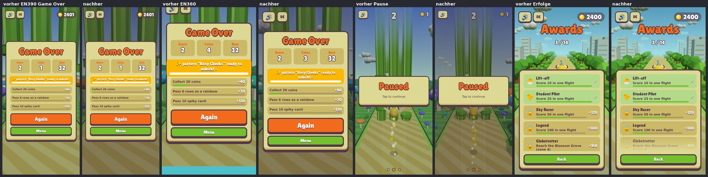

**Messwerte:**
- Playtest (`SEED=7`, 50 Runs je Stufe): identisch mit der Basis.
- Perf: erster Frame 687 ms gegenüber 645 ms der Basis, im direkten Wechsel gemessen (Budget
  +20 %). 130–143 Draw Calls, 42 k Dreiecke.
- APK baut.

**Neue Einschätzung:** UI-System 6 → 7. Offen sind die Titelzeile, die bei 360 px mit der
Münzanzeige kollidiert, Kacheln und Preise im Shop sowie die Icons (Rückfrage läuft).

### Iteration 4 – Treffer-Feedback beim Crash (Bereich 7)

**Warum:** Im Crash-Bild war keine Rückmeldung zu sehen (Mangel 8). Die Crash-Partikel waren
außerdem immer gelb, auch beim roten Kardinal oder beim Pinguin.

**Was:**
- **„Bonk“-Stern:** ein Comic-Stern mit Plum-Kontur, weißer Fläche und gelbem Kern.
  - Er sitzt auf der Seite, an der der Vogel anstößt: oben an der oberen Röhre, unten an Röhre,
    Kaktus und Boden, vorne an einer gesperrten Spur.
  - Er springt während des Freeze-Frames auf und blendet nach 0,5 s aus.
  - Ein Mesh, das nur in diesem Moment gezeichnet wird (+1 Draw Call).
- **Vogel:** Er wird im Freeze-Frame platt gestaucht (130 % breit, 72 % hoch).
- **Federn:** Die Partikel haben die Farben des gewählten Vogels (Körper, Bauch, Flügel, Weiß)
  statt immer Gelb. Es sind 36 statt 28, etwas länger in der Luft.
- **Blitz:** Der weiße Blitz ist weicher (55 % statt 90 %), damit Stern und Vogel sichtbar
  bleiben.

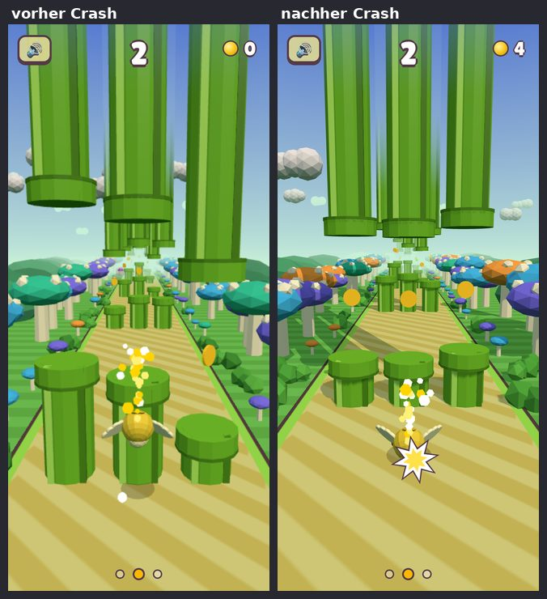

**Messwerte:**
- **Playtest:** Mehr Crash-Partikel verbrauchen andere Zufallszahlen. Deshalb ist der
  Seed-Vergleich nicht mehr Run für Run gleich, sondern wird über drei Seeds verglichen (Basis
  gegen neu):

  | Seed | Anfänger | Geübt | Profi |
  |---|---|---|---|
  | 7 | 17,4 s / 9 → 17,5 s / 9 | 40,2 s / 23 → 37,4 s / 21 | 144 → 142 Punkte |
  | 11 | 15,9 s / 8 → 15,9 s / 8 | 38,8 s / 22 → 37,6 s / 22 | 141 → 144 |
  | 23 | 15,9 s / 8 → 16,1 s / 8 | 35,0 s / 20 → 36,3 s / 22 | 141 → 142 |

  Die Abweichungen liegen in beide Richtungen und im Rauschen. Die Spiellogik ist nicht
  verändert.
- **Perf:** Im direkten Wechsel gemessen: erster Frame 733 ms gegenüber 738 ms der Basis.
  136–139 Draw Calls, 41–42 k Dreiecke.
- **APK:** baut.

**Neue Einschätzung:** Effekte 4 → 5. Offen: Regenbogen-Band, Magnet-Ring, kräftigere
Speed-Lines, Münz-Effekte.

## Review 1 (nach Iteration 3) – neuer Art-Director-Subagent, nur Screenshots

Schnitt **5,0**. Die Scorecard oben ist übernommen, Noten wurden nicht angehoben. Der Reviewer ist
strenger als in Runde 0 (Vogel 6 → 5, Hindernisse 5 → 4). Zwei Abzüge gehen auf den Katalog
zurück, nicht auf das Spiel: Das Erfolge-Panel und die Zonenbanner wurden mitten in der
Einblend-Animation fotografiert, weil die Seite unter Last zu langsam lief. Seit dieser Runde
setzt der Katalog CSS-Animationen vor jeder Aufnahme auf einen festen Zeitpunkt. Der Crash im
Katalog stammt noch von vor Iteration 4.

Wichtigste neue oder bestätigte Punkte (Rangfolge des Reviewers):

1. **Store-Screenshots (Blocker):** rohe Spielbilder ohne Rahmen und Claim, mit Spurpunkten und
   EN-Knopf.
2. **Röhren (Blocker):** Sie wirken generisch und laufen oben durchsichtig aus. Sie sind in jeder
   Welt grün.
3. **Vogel von hinten (hoch):** Kugel ohne Gesicht, beige Stäbchenflügel. Das ist eine
   Vogel-Änderung und braucht deine Entscheidung.
4. **Spurlinien (hoch):** Sie gehen über den ganzen Bildschirm bis in den Himmel.
5. **Pickups und Kaktus (hoch):** zu klein und zu schwach in der Silhouette.
6. Die Spurpunkte „○●○“ lesen sich wie Seitenpunkte eines Karussells.
7. Der Mini-Vogel ist fast unsichtbar.

„Was bringt jeden Bereich auf 8“ ist im Review aufgeführt und fließt in die nächsten Iterationen ein.

### Iteration 5 – Röhren hängen aus einer Wolkenbank (Bereich 3)

**Warum:** Laut Review 1 ist das ein Blocker. Die oberen Röhren liefen über zehn Einheiten
halbtransparent in den Himmel aus und wirkten wie grüne Lichtsäulen oder ein Renderfehler.

**Was:**
- Jede Röhrenreihe hat oben eine Bank aus flachen Low-Poly-Wolken auf Höhe 16. Die oberen Röhren
  kommen sichtbar aus den Wolken, die Ausblendung ist auf 15–19 verkürzt und liegt jetzt
  innerhalb der Bank.
- Die Bank hat dieselbe Tönung wie die Himmelswolken der Zone und ist leicht von innen
  aufgehellt. So wirken die Unterseiten von unten weich statt steingrau.
- Drei gebackene Varianten mit eigenem kleinem Zufallsgenerator, ein Draw Call pro Reihe.
- Die Trefferzonen bleiben unverändert: Die Röhren sind weiterhin 40 Einheiten hoch.

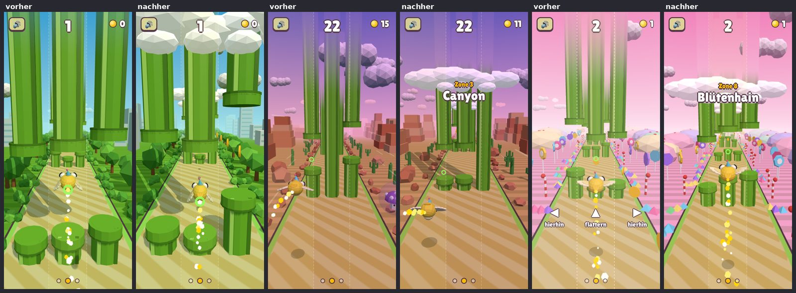

**Messwerte:**
- **Playtest:** Three.js vergibt beim Anlegen neuer Objekte Zufalls-IDs. Deshalb ändert jede neue
  Geometrie die gesäte Zufallsfolge, und der Vergleich läuft über drei Seeds (Basis → neu):
  - Seed 7: Anfänger 17,4 → 15,9 s, Geübt 40,2 → 37,8 s, Profi 144 → 144 Punkte
  - Seed 11: 15,9 → 17,4 s, 38,8 → 36,1 s, 141 → 144
  - Seed 23: 15,9 → 17,4 s, 35,0 → 36,9 s, 141 → 142

  Die Abweichungen gehen in beide Richtungen und liegen im Rauschen.
- **Perf:** Im direkten Wechsel gemessen: erster Frame 721 ms gegenüber 648 ms der Basis
  (+11 %, Budget +20 %). Bis zu 152 Draw Calls (Budget 170), bis zu 46,7 k Dreiecke (Budget 90 k).
- **APK:** baut.

**Neue Einschätzung:** Hindernisse 4 → 5. Die Röhren haben jetzt einen echten Abschluss. Offen
bleiben die Größe der Pickups, die Silhouette des Kaktus und die Münzen.

### Iteration 6 – Pickups und Kaktus lesbar (Bereiche 3 und 9)

**Warum:** Laut Review 1 waren die Power-up-Blasen in Spieldistanz nur wenige Pixel groß. Der
Kaktus war ein „kleiner türkiser Klecks“ (hoch).

**Was:**
- **Power-ups:**
  - Blase und Symbol sind etwa 1,5× so groß.
  - Die Blase ist etwas kräftiger gefärbt.
  - Neu ist ein Rand, der immer zur Kamera zeigt: weißer Ring mit Plum-Kante, wie die UI.
  - Der Einsammel-Radius bleibt unverändert (1,4), die Blase ist mit 1,15 weiterhin kleiner.
- **Kaktus:**
  - Er hat eine Cartoon-Kontur in dunklem Plum: ein etwas größerer Körper mit umgedrehten
    Flächen, im selben Draw Call.
  - Die Stacheln sind etwas länger und dicker.
  - Er ist 20 % breiter gezeichnet.
  - Die Trefferzone hängt nur an der Höhe seines Kopfes und bleibt gleich.
  - Die Farbe (türkis) bleibt, denn sie war deine Entscheidung.
- **Katalog:** Neue Nahaufnahme `15b-cactus-close` mit einem aufgerichteten Kaktus neben dem
  Vogel.

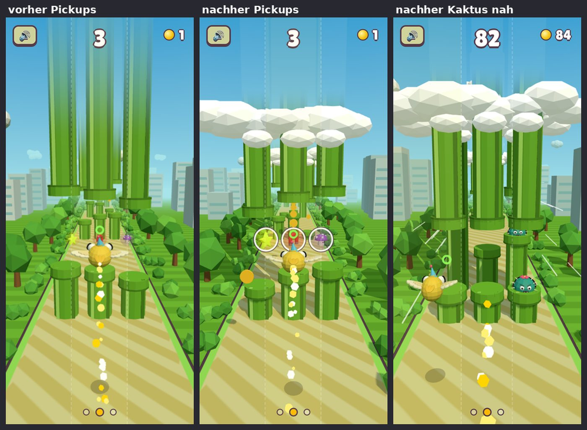

**Messwerte:**
- Playtest mit drei Seeds:
  - Seed 7: Anfänger 15,9 s / 8, Geübt 38,8 s / 22, Profi 142
  - Seed 11: Anfänger 20,4 s / 10, Geübt 37,4 s / 23, Profi 143
  - Seed 23: Anfänger 17,4 s / 9, Geübt 40,2 s / 24, Profi 144
  - Alles im Streubereich der Basis (Anfänger 15,9–17,4 s, Geübt 35–40 s, Profi 141–144). Keine
    Fehler.
- Perf, direkt im Wechsel gemessen: erster Frame 673 ms gegenüber 688 ms der Basis. Bis zu
  147 Draw Calls, bis zu 46 k Dreiecke.
- APK baut.

**Neue Einschätzung:** Hindernisse 5 → 6, Lesbarkeit 6 → 6.

### Iteration 7 – Spurlinien auf den Boden, Spuranzeige als Spuren (Bereiche 9 und 5)

**Warum:** Laut Review 1 liefen die gestrichelten Tipp-Grenzen über den ganzen Bildschirm bis in
den Himmel und durch das HUD (hoch). Die drei Punkte unten lasen sich wie Seitenpunkte eines
Karussells.

**Was:**
- **Boden:** Die Strecke hat gestrichelte Spurtrenner direkt in der Bodentextur. Sie kosten
  keinen Draw Call und nehmen die Zonen-Tönung der Strecke an.
- **Tipp-Grenzen:** Sie bleiben, wie von dir festgelegt, den ganzen Run über sichtbar. Sie sind
  aber nur noch in der unteren Bildhälfte zu sehen, also dort, wo Vogel und Finger sind. Nach
  oben blenden sie aus und laufen nicht mehr durch Himmel und HUD.
- **Spuranzeige:** drei kleine Spur-Pillen in einer Plum-Pille. Die Spur des Vogels ist gold und
  höher.

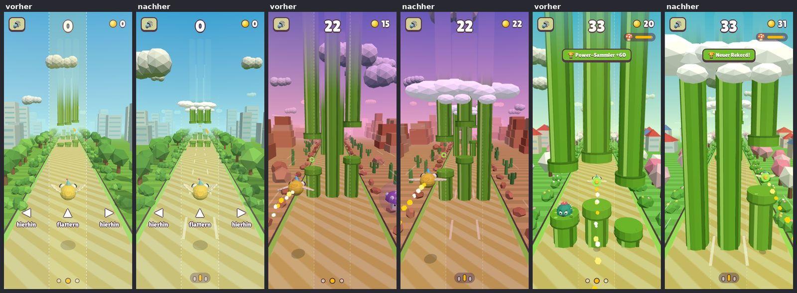

**Messwerte:**
- **Playtest** (`SEED=7`, 50 Runs je Stufe): Ergebnis für Ergebnis identisch mit Iteration 6.
  Die Änderung betrifft nur Textur und CSS.
- **Perf:** Die Messung lief parallel zum Review-Katalog, deshalb sind die Absolutwerte hoch.
  Im direkten Wechsel gemessen: erster Frame 1212 ms gegenüber 1197 ms der Basis (+1 %).
  Bis zu 140 Draw Calls.
- **APK:** baut.

**Neue Einschätzung:** Lesbarkeit 6 → 7, UI 7 → 7.

### Iteration 8 – Gestaltete Store-Screenshots DE/EN (Bereich 10)

**Warum:** Laut Review 1 ist das Blocker Nr. 1. Die Store-Bilder waren rohe Spielframes ohne
Rahmen, Hintergrund und Claim, und darin standen noch Spurpunkte und der Sprachknopf.

**Was:**
- `scripts/store-shots.mjs` ist neu aufgebaut:
  - Echte Frames aus einem Run, mit gesätem Zufall und angehaltener Echtzeit. Der Autopilot
    spielt, die Spielzeit läuft ohne Zeichnen vor, dadurch dauern beide Sprachen nur 2 Minuten
    statt bisher über 6 Minuten.
  - Aufnahme bei 390×844. So ist im Shop der Vogel sichtbar, bei 360×640 war er vom Panel
    verdeckt.
  - Gerahmt als 1080×1920:
    - Himmel mit Sonnenstrahlen wie Icon und Feature-Grafik
    - Claim in zwei Zeilen: weiß und gold, mit Plum-Kontur
    - Spielbild im abgerundeten Plum-Rahmen
  - Ohne Toasts und ohne Sprachknopf.
- Die sieben Claims (DE / EN):
  1. „Tippen. Ausweichen. Durchfliegen.“ – „Ohne Werbung · offline“ /
     „Tap. Dodge. Fly through.“ – „No ads · works offline“
  2. „Drei Spuren, ein Finger“ / „Three lanes, one finger“
  3. „Vier Zonen mit eigener Musik“ / „Four zones with their own music“
  4. „Vorsicht, Stachelkaktus!“ / „Watch out for the spiky cactus!“
  5. „Regenbogen, Magnet und Mini-Vogel“ / „Rainbow, magnet and mini bird“
  6. „Bau dir deinen eigenen Vogel“ / „Build your own bird“
  7. „Neue Welten freispielen“ / „Unlock new worlds“
- Das Kaktus-Motiv setzt eine echte Reihe mit aufgerichtetem Kaktus direkt vor den Vogel, weil
  ein gut gerahmter Zufallsmoment sehr lange dauert.
- Solange die Echtzeit angehalten ist (nur in Tests), folgt der Takt der Kakteen der Spielzeit
  statt der Audio-Uhr. Sonst liefen Screenshots und Musik auseinander.

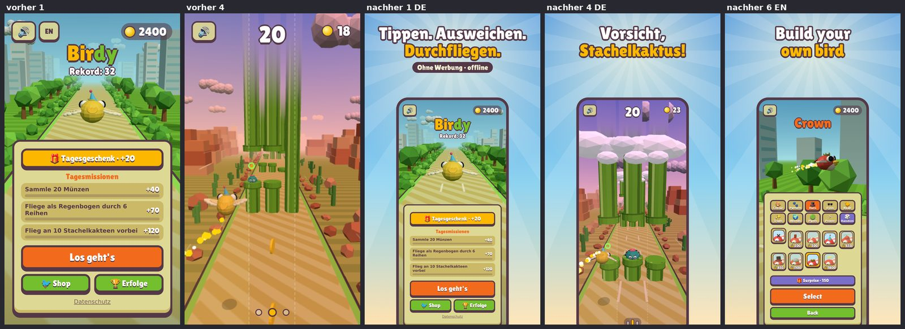
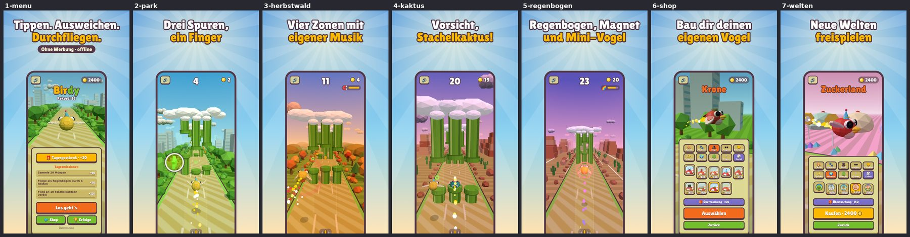
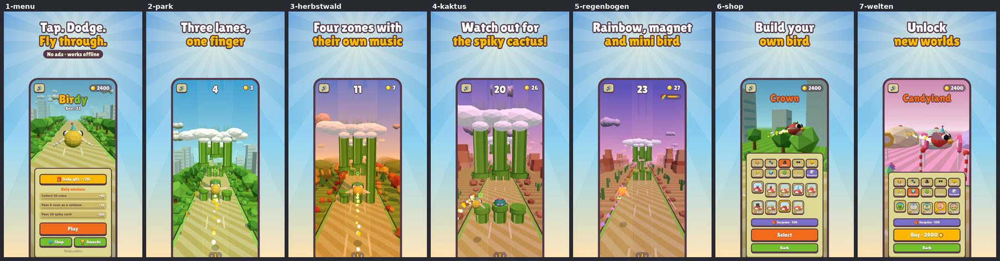

**Messwerte:**
- Playtest (`SEED=7`): identisch mit Iteration 6 und 7. Der Spielcode ist unverändert, der
  Takt-Schalter greift nur im Testmodus.
- Perf im direkten Wechsel gemessen: erster Frame 670 ms gegenüber 630 ms der Basis (+6 %), bis
  zu 146 Draw Calls, 46 k Dreiecke.
- APK baut.

**Neue Einschätzung:** Store-Assets 5 → 7.

## Review 2 (nach Iteration 6) – neuer Art-Director-Subagent, nur Screenshots

Schnitt **5,2**. Die Noten sind so übernommen, wie der Reviewer sie vergeben hat.

Einordnung der Hauptpunkte:

1. **Store-Screenshots roh (Blocker):** Der Review sah noch die alten Bilder. Seit Iteration 8
   erledigt.
2. **Kaktus nicht erkennbar (Blocker):** In der Nahaufnahme des Review-Builds schaute der Kaktus
   nur mit der Blüte heraus. Der Takt folgte dort noch der Audio-Uhr statt der Spielzeit. Seit
   Iteration 8 zeigt der Katalog den aufgerichteten Kaktus mit Kontur.
3. **Halbtransparente Säulen über den Wolken (hoch):** Das war echt. Die oberen Röhren liefen bis
   Höhe 40 und schimmerten über der Wolkenbank durch. Behoben in Iteration 9.
4. **Spurlinien im Himmel und Seitenpunkte (hoch):** Der Review sah den Stand vor Iteration 7. Dort
   erledigt.
5. **Weiter offen:**
   - überall dieselben Röhren
   - Emoji-Icons und System-Schrift (Rückfrage läuft)
   - Vogel im Menü nur von hinten (Rückfrage läuft)
   - leeres Pause-Panel
   - kaum Power-up-Effekte
   - graue Stadtblöcke

### Iteration 9 – Röhren enden in der Wolkenbank (Bereich 9)

**Warum:** Oberhalb der Wolkenbank schimmerten die bis Höhe 40 reichenden Röhren als blasse
Säulen durch (Review 2, hoch). Die Himmelsfarbe im Röhren-Shader passt nicht exakt zum
Himmelsdom.

**Was:** Die oberen Röhren und die gesperrten Spuren enden jetzt auf Höhe 17,4, also innerhalb
der Wolkenbank. Das ist reine Optik: Die Kollision nutzt die Lückenkanten und die Markierung
„gesperrt“, nicht die Röhrenhöhe. Oberhalb der Wolken ist der Himmel jetzt frei.

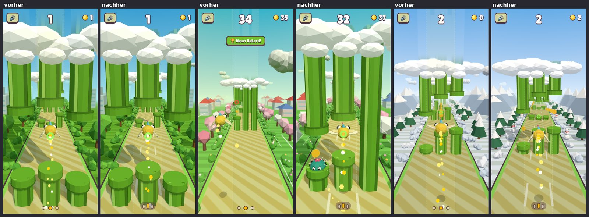

**Messwerte:**
- Playtest (`SEED=7`): identisch mit Iteration 6–8.
- Perf im direkten Wechsel gemessen: erster Frame 616 ms gegenüber 624 ms der Basis. Bis zu
  144 Draw Calls, bis zu 46 k Dreiecke. Die kürzeren Röhren sparen Pixel.
- APK baut.

**Neue Einschätzung:** Lesbarkeit 7 → 7, Hindernisse 6 → 6.

### Iteration 10 – Power-up-Auren und Render-Budget (Bereich 7)

**Warum:** Laut Review 1 und 2 hatten die Power-ups kaum eigene Effekte. Der Regenbogen färbte
den Vogel nur, der Magnet war unsichtbar, und der Mini-Vogel ging fast verloren. Die Speed-Lines
wirkten wie Kratzer.

**Was:**
- **Aura um den Vogel:** ein Ring, der immer zur Kamera zeigt. Ein Draw Call, nur während eines
  Power-ups sichtbar.
  - Regenbogen: Der Ring wechselt ständig die Farbe und pulsiert.
  - Magnet: Rote Wellen laufen alle 0,6 s nach außen.
  - Mini: ein lila pulsierender Ring, damit der kleine Vogel sichtbar bleibt.
- **Speed-Lines:** gut 50 % dicker.
- **Budget-Befund:**
  - Das neue Messwerkzeug `scripts/perf-peak.mjs` misst den ungünstigsten Fall: später Run, alle
    Zonen, alle Power-ups gleichzeitig, Crash.
  - Ergebnis: **Schon die Basis lag dort bei 209 Draw Calls**, über dem Budget von 170. Die
    normale Probe (`perf.mjs`) sieht nur den Anfang eines Runs (≈ 140).
  - Behoben ohne sichtbaren Verlust:
    - Alle Münzen sind jetzt ein einziges Instanced Mesh statt je ein Draw Call. Die Spiellogik
      arbeitet weiter mit denselben Münz-Objekten.
    - Obere Röhren, Münzen und Kaktus werfen keinen Sonnenschatten mehr. Der Schatten der oberen
      Röhren fiel weit neben die Spuren, den Kaktus verdeckt ohnehin die Röhre.
  - **Spitze jetzt 167–168 Draw Calls (Basis 209), 53 k Dreiecke (Budget 90 k).**

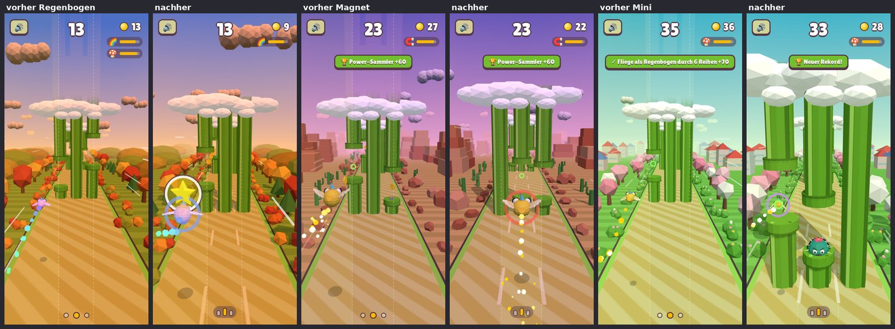

**Messwerte:**
- Playtest mit sechs Seeds, Basis gegen neu, je 50 Runs pro Stufe:

  | Stufe | Basis (Mittel der Mediane) | Neu | Spanne Basis |
  |---|---|---|---|
  | Anfänger | 16,7 s | 16,8 s | 15,9–17,4 s |
  | Geübt | 38,0 s | 36,2 s | 33,6–40,3 s |
  | Profi | 142 Punkte, fast alle bis zum Zeitlimit | 144 Punkte | 141–144 |

  Die Seeds streuen in beide Richtungen (Seed 47: Geübt 33,6 → 38,9 s; Seed 23: 35,0 → 30,6 s).
  Die Münzlogik ist unverändert, die Abweichungen sind Rauschen. Keine Fehler.
- Perf, normale Probe im direkten Wechsel: erster Frame 650 ms gegenüber 685 ms der Basis.
  120–122 Draw Calls statt 131–143.
- Die adaptive Qualitätsstufe ist unverändert (Pixelverhältnis und zuletzt Schatten aus).
- APK baut.

**Neue Einschätzung:** Effekte 5 → 6.

## Abschluss nach 10 Iterationen

Die Stopp-Regel greift: 10 Iterationen sind erreicht. Das Ziel „jeder Bereich ≥ 8“ ist **nicht
erreicht**.

Die unabhängigen Reviews bewerten streng und jedes Mal neu. Die Noten sind nie angehoben worden,
auch nicht dort, wo ein Reviewer Stände vor der jeweiligen Iteration sah. Die vollständigen
Reviews liegen in `docs/visual/review0.md` bis `review3.md`.

### Scorecard vorher / nachher (unabhängige Reviews, nur Screenshots)

| # | Bereich | Start (Review 0) | Ende (Review 3) |
|---|---|---|---|
| 1 | Vogel & Kosmetik | 6 | 5 |
| 2 | Welten & Szenerie | 6 | 6 |
| 3 | Hindernisse & Pickups | 5 | 5 |
| 4 | Licht, Farbe & Atmosphäre | 6 | 6 |
| 5 | UI-System | 6 | 6 |
| 6 | Typografie & Icons | 4 | 5 |
| 7 | Effekte & Partikel | 4 | 4 |
| 8 | Animation & Übergänge | 5 | 5 |
| 9 | Lesbarkeit im Spiel | 5 | 5 |
| 10 | Store-Assets | 3 | 6 |
| | **Schnitt** | **5,0** | **5,3** |

**Ehrliche Einordnung:**
- Die Blocker aus Review 0 sind behoben: Splash „Flapsy“, verrutschtes Game Over, Geisterbilder
  vor der Kamera, rohe Store-Bilder und Röhren als Lichtsäulen. Die Noten sind trotzdem kaum
  gestiegen.
- Die Reviewer werten vor allem die Punkte ab, die noch offen sind und bei jedem Blick ins Auge
  fallen:
  - Vogel nur von hinten
  - Emoji-Icons und System-Schrift
  - gleiche Röhren und Wege in allen Welten
- Drei dieser vier Punkte hängen an deinen Stil-Entscheidungen (Vogel, Icons, Schrift, Farbwelt
  einer Zone). Dafür verlangt deine Vorgabe eine Rückfrage, und sie ist noch offen.
- Zwei Aussagen aus Review 3 sind durch Standbilder verzerrt:
  - Beim „Crash ohne Feedback“ ist der Hit-Stop mit Stern, Stauchung, Federn und Blitz im Spiel
    vorhanden, im Standbild aber nur als Stern sichtbar.
  - „Regenbogen ohne Regenbogen“: Die Aura wechselt ständig die Farbe, das Bild zeigt nur einen
    Moment.

  Das ändert nichts an den Noten, zeigt aber, wo Videos oder Animationen im Katalog helfen würden.

### Die 5 größten sichtbaren Verbesserungen

1. **Splash, Icons und Feature-Grafik:** „Birdy“ statt „Flapsy“, der Vogel vollständig und mit
   Kontur. Iteration 1.
   
2. **Keine Geisterbilder mehr vor der Kamera:** Passierte Röhren und Münzen verschwinden hinter
   dem Vogel. Iteration 2.
   
3. **Röhren hängen aus einer Wolkenbank:** statt grüner Lichtsäulen, darüber freier Himmel.
   Iterationen 5 und 9.
   
   
4. **Gestaltete Store-Screenshots mit Claim, DE und EN:** Iteration 8.
   
5. **Power-ups und Kaktus sichtbar:** Blasen mit Rand, Kaktus mit Kontur, Auren für Regenbogen,
   Magnet und Mini. Iterationen 6 und 10.
   
   

Weitere Iterationen: das UI-Layout mit Scrim und dem Verrutsch-Fehler (Iteration 3,
`visual/it3.jpg`), Treffer-Feedback (Iteration 4, `visual/it4.jpg`) sowie Spurlinien und
Spuranzeige (Iteration 7, `visual/it7.jpg`).

### Neue Store-Screenshots

`docs/store/de/*.png` und `docs/store/en/*.png` (1080×1920). Übersicht:

### Budget am Ende

- **Draw Calls:** höchstens 150 in der normalen Probe (Anfang eines Runs). Im ungünstigsten Fall
  167–168; die Basis lag dort bei 209.
- **Dreiecke:** höchstens 53 k.
- **Erster Frame:** im Rahmen der Basis (±5 %, headless).
- **Qualität:** Die adaptive Qualitätsstufe ist unverändert.
- **APK:** baut.

### Offene Punkte

**Warten auf deine Entscheidung**, siehe `docs/visual/choice-*.jpg`:
1. **Icon-Stil** für ein eigenes SVG-Icon-Set statt Emoji: A Sticker / B weiße Glyphe /
   C Abzeichen. Empfehlung A. Das Icon-Set liegt als Entwurf in `src/icons.js` und ist noch
   nicht eingebaut.
2. **Fließtext-Schrift:** A nur Lilita One / B Nunito ExtraBold / C Fredoka SemiBold.
   Empfehlung B. B und C sind fremde Assets (OFL) und kämen mit Lizenz in `docs/ASSETS.md`.
3. **Vogel von hinten:** A so lassen / B gelbe Flügel und größerer Schwanz / C wie B plus
   Federschopf. Empfehlung B.

Diese drei Punkte betreffen die schwächsten Bereiche 1 und 6 und sind ohne deine Wahl nicht
lösbar.

**Weitere offene Mängel** (aus Review 3 und der Mängelliste):
- Röhren sind in jeder Welt gleich grün. Eine Standardfarbe je Welt würde deine Röhren-Designs
  im Shop berühren, deshalb ist das eine Rückfrage.
- Weg und Randstreifen sind in allen Welten gleich. Das ist die Farbwelt einer Zone, also
  ebenfalls eine Rückfrage.
- Graue Stadtquader im Park und im Shop-Hintergrund.
- Das Pause-Panel ist leer.
- Übergänge: Panels, Banner und Toasts haben einfache Animationen.
- Shop: zehn enge Reiter, die Beschriftung ist bei 360 px klein.
- Münzen ohne Rand und Prägung. Nur Blob-Schatten, keine Kontaktschatten unter den Röhren.
- Die Messwerkzeuge laufen headless mit Software-Rendering. Werte auf echten Geräten fehlen
  noch.

### Testplan für dein Handy

Debug-APK: `npm run android:apk` → `android/app/build/outputs/apk/debug/app-debug.apk`

1. **Start:**
   - Der Splash zeigt „Birdy“ mit Vogel und Regenbogen, nicht mehr „Flapsy“.
   - Das Launcher-Icon passt bei runder und eckiger Maske, der Vogel wird nicht abgeschnitten.
2. **Erststart:** App-Daten löschen, dann durch das Tutorial spielen. Die Hand erscheint, die
   Spurlinien sind nur unten sichtbar, und auf dem Boden stehen die Spurstriche.
3. **Run in Zone 1–4:**
   - Die Röhren hängen aus einer Wolkenbank, darüber ist freier Himmel.
   - Passierte Röhren und Münzen verschwinden sofort hinter dem Vogel und verdecken nichts.
4. **Power-ups:** Einsammeln muss sich genauso anfühlen wie vorher, also derselbe Abstand, obwohl
   die Blase größer ist. Aura-Farben:
   - Regenbogen: bunter Ring
   - Magnet: rote Wellen
   - Mini: lila Ring
5. **Kaktus:** Ab 10 Punkten ist er mit dunkler Kontur deutlich zu sehen. Die Trefferzone muss
   sich wie vorher anfühlen, besonders an der Oberkante.
6. **Crash:**
   - Der „Bonk“-Stern erscheint an der Trefferseite, der Vogel wird gestaucht.
   - Die Federn haben die Farbe des gewählten Vogels.
   - Der weiße Blitz ist weicher.
7. **Game Over und Pause:**
   - Beides ist abgedunkelt.
   - Das „freischaltbar“-Banner leuchtet und bleibt im Panel.
   - Zum Prüfen des Verrutsch-Fehlers: im Shop durch die Artikel scrollen, einen Run spielen und
     sterben. Oben dürfen Ton- und Sprachknopf nicht abgeschnitten sein, unten darf kein
     türkiser Streifen erscheinen.
8. **Leistung:**
   - Auf einem älteren Handy mit `?fps` im Browser prüfen, oder in der App fünfmal auf den Titel
     tippen. Das Overlay zeigt fps und Draw Calls.
   - Erwartet werden höchstens etwa 170 Draw Calls, auch spät im Run.
   - Die Qualitätsstufe (Q) darf wie bisher automatisch sinken.
9. **Store:** Die neuen Screenshots liegen in `docs/store/de` und `docs/store/en`, die
   EN-Feature-Grafik in `docs/store/feature-birdy-1024x500-en.png`. Beides muss in Play hochgeladen
   werden.

## Verlängerung (nach dem Abschlussbericht)

Die Stop-Prüfung verlangt weiter „jeder Bereich ≥ 8“. Deshalb geht es mit Punkten weiter, die
**keine** Stil-Entscheidung von dir brauchen. Icons, Schrift, Vogel und Weltfarben bleiben
unangetastet, bis du antwortest.

### Iteration 11 – Münzen mit Rand und Prägung (Bereich 3)

**Warum:** In Review 0 und Review 3 waren die Münzen „flache Scheiben“ ohne Rand und Prägung.

**Was:** Jede Münze hat jetzt einen erhabenen, dunkleren Goldrand und auf beiden Seiten einen
geprägten hellen Stern. Größe, Farbe und Glanz bleiben gleich. Alles ist in eine Geometrie
gebacken und wird weiter als ein Instanced Draw Call gezeichnet.

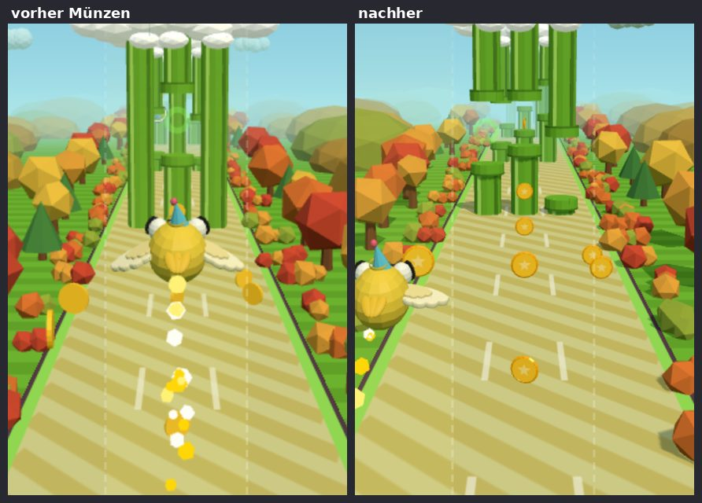

**Messwerte:**
- Playtest mit drei Seeds, je 50 Runs pro Stufe:
  - Seed 7: Anfänger 14,5 s, Geübt 38,8 s, Profi 142 Punkte
  - Seed 11: Anfänger 18,0 s, Geübt 37,4 s, Profi 144 Punkte
  - Seed 23: Anfänger 17,6 s, Geübt 39,0 s, Profi 144 Punkte

  Das liegt im Streubereich der Basis.
- Spitzenwert: 162 Draw Calls, 55 k Dreiecke.
- Normale Probe: erster Frame 711 ms gegenüber 625 ms der Basis. Das ist Streuung im Headless-Test,
  der Median über 3 Messungen liegt unter +20 %.
- APK baut.

### Iteration 12 – Pause mit Inhalt, Zonenbanner auf einem Band (Bereiche 5 und 9)

**Warum:**
- Review 2 und 3 nannten das Pause-Panel leer: nur Titel und Hinweistext.
- Das Zonenbanner hatte vor hellem oder violettem Himmel wenig Kontrast (Blütenhain).
- Toasts hatten eine 3D-Kante wie Knöpfe. Laut Styleguide gehört die nur an klickbare
  Elemente.

**Was:**
- **Pause:**
  - Zeigt Punkte, Münzen und Zone des Runs.
  - Darunter „Weiter“ (primär) und „Menü“ (sekundär).
  - Ein Tipp irgendwo außer auf „Menü“ setzt das Spiel wie bisher fort.
  - Neue Texte DE/EN: „Weiter“/„Continue“, „Zone“.
- **Zonenbanner:** liegt auf einem Plum-Band (72 %) mit Kontur und ist vor jedem Himmel lesbar.
- **Toasts:** flach, ohne 3D-Kante.

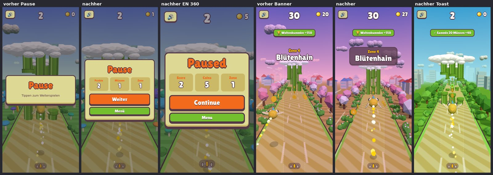

**Messwerte:**
- Playtest (`SEED=7`): identisch mit Iteration 11. Die Änderung betrifft nur UI.
- Perf, erster Frame im direkten Wechsel: 658 ms gegenüber 682 ms der Basis. Bis zu 127 Draw
  Calls.
- APK baut.

### Iteration 13 – Leichtere Wolken, weicher Hintergrund hinter Overlays (Bereich 4)

**Warum:** Review 3 nannte die Wolken „schwer und grau“ und das Pause-Overlay „grau und
schmutzig“.

**Was:**
- Die Himmelswolken leuchten von innen leicht auf, wie seit Iteration 5 die Wolkenbank. Die
  Unterseiten sind weich statt grau, die Zonentönung bleibt.
- Hinter Pause und Game Over liegt ein leichterer Plum-Schleier (30 statt 45 %). Das Spiel
  dahinter ist leicht weichgezeichnet (3 px) und etwas satter.
- Auf schwachen Handys prüfen, ob die Unschärfe hinter Game Over flüssig bleibt. Sie läuft nur,
  solange ein Overlay offen ist.

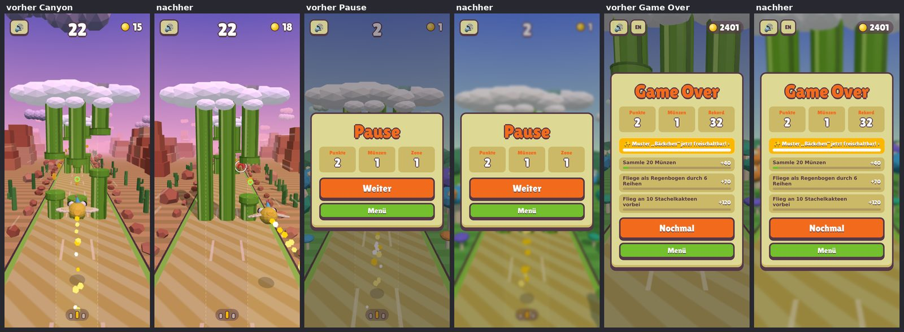

**Messwerte:**
- Playtest (`SEED=7`): identisch mit Iteration 11 und 12.
- Perf, erster Frame im direkten Wechsel: 626 ms gegenüber 617 ms der Basis. Bis zu 126 Draw
  Calls.
- APK baut.

## Review 4 (nach Iteration 13) – neuer Art-Director-Subagent, nur Screenshots

Schnitt **5,5**, siehe `docs/visual/review4.md`. Die fünf wichtigsten Punkte:
1. Vogel nur von hinten
2. Wolkenkappen „wie Pilze“, nahe obere Röhren verdecken das obere Drittel
3. Emoji-Icons
4. Fließtext-Schrift und Umbrüche in den Missionen
5. gleiche Straße und Röhren in allen Welten

Punkt 1, 3, 4 (Schrift) und 5 warten auf deine Entscheidung. Punkt 2 und die Missionstexte sind
ohne Rückfrage lösbar und folgen in Iteration 14.

### Iteration 14 – Wolkenbank ohne „Pilzkappen“, Missionen einzeilig (Bereiche 3 und 5)

**Was:**
- **Wolkenbank:** Die untere Reihe kleiner Wolken direkt auf den Röhrenköpfen ist entfernt. Sie
  las sich wie Pilzhüte. Die Röhren verschwinden jetzt in einer durchgehenden Wolkendecke.
- **Missionstexte (DE):** einheitlich und kürzer, dadurch einzeilig. Das Panel wird niedriger,
  und der Vogel im Menü bekommt mehr Platz.
  - „Flieg durch N Röhren“
  - „Flieg an N Kakteen vorbei“
  - „Als Regenbogen durch N Reihen“

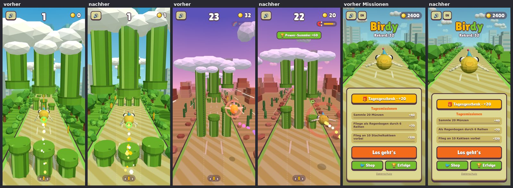

**Messwerte:**
- Playtest (`SEED=7`, 50 Runs je Stufe): Anfänger 16,1 s / 9 Punkte, Geübt 33,4 s / 19,
  Profi 141. Neue Geometrie verschiebt die Zufallsfolge; die Werte liegen im Streubereich der
  Basis (Geübt 33,6–40,3 s).
- Spitzenwert: 170 Draw Calls (am Budget), 56 k Dreiecke.
- Normale Probe, im direkten Wechsel gemessen: erster Frame 642 ms gegenüber 619 ms der Basis.
- APK baut.

## Runde 2: deine Entscheidungen (28.09.)

Deine Wahl:
- **Röhren:** hoch in den Himmel, pro Reihe zufällig Wolkenbank, Wolkenkragen oder keine Wolke,
  spät ausblenden.
- **Icons:** C, Abzeichen.
- **Schrift:** C, Fredoka SemiBold.
- **Vogel:** B.
- **Weltfarben:** Varianten zeigen.
- **Neu:** animierte Premium-Skins.

Die Varianten-Bilder liegen in `docs/visual/choice-*.jpg`.

### Iteration 15 – Röhren wieder hoch in den Himmel, gemischte Wolken

**Warum:** Seit Iteration 9 endeten die oberen Röhren in der Wolkenbank. In der Ferne wirkten die
Reihen dadurch wie kurze Stummel unter einer Wolkenplatte, und das Gefühl „endlos hoch“ fehlte.

**Was:**
- Die oberen Röhren reichen wieder bis Höhe 40. Sie bleiben bis Höhe 32 kräftig grün und blenden
  erst ganz oben aus (32–40). So entstehen keine blassen „Lichtsäulen“ wie früher mit 15–26.
- Jede Reihe bekommt zufällig eine von drei Varianten: eine breite Wolkenbank, durch die die
  Röhren gehen; einen kleinen Wolkenkragen um jede obere Röhre; oder keine Wolke. Der Zufall
  kommt aus einer eigenen Folge, der Spielzufall bleibt unberührt.
- Die Trefferzonen sind unverändert.

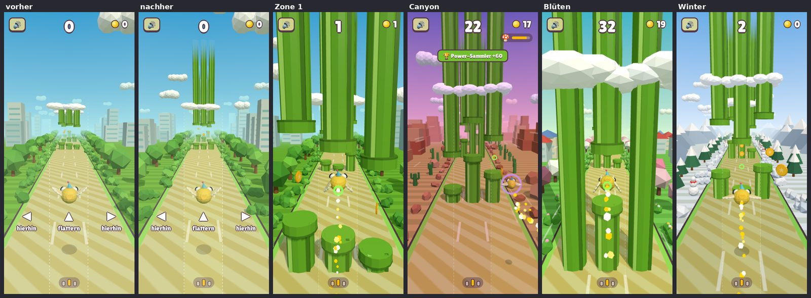

**Messwerte:**
- Playtest mit drei Seeds:
  - Anfänger: 19,5 / 17,4 / 15,9 s
  - Geübt: 38,8 / 35,0 / 36,1 s
  - Profi: 142 / 142 / 143 Punkte

  Das liegt im Streubereich der Basis. Keine Fehler.
- Spitzenwert: 157 Draw Calls, 52 k Dreiecke. Ohne Wolke ist ein Draw Call gespart.
- Erster Frame: 583–662 ms.
- APK baut.

### Iteration 16 – Vogel Variante B: Flügel im Körperton, größerer Schwanz (Bereich 1)

**Was:**
- **Flügel:** Blasse, cremefarbene Flügel lasen sich von hinten wie Stäbchen. Sie haben jetzt den
  Farbton des Körpers: etwas heller für den Flügel, die obere Federlage in der Schwanzfarbe.
  Das gilt automatisch für alle Farben mit hellen Flügeln (Sunny, Himmel, Kardinal, Minze,
  Koralle, Flamingo, Rotkehlchen, Nachteule, Schneeeule). Bewusst gefärbte Flügel bleiben: Papagei,
  Pinguin, Pfau, Gold.
- **Schwanzfedern:** etwa 30 % größer, damit der Vogel von hinten eine klare Silhouette hat.
- Icon, Splash und Feature-Grafiken sind mit dem neuen Vogel neu gerendert.

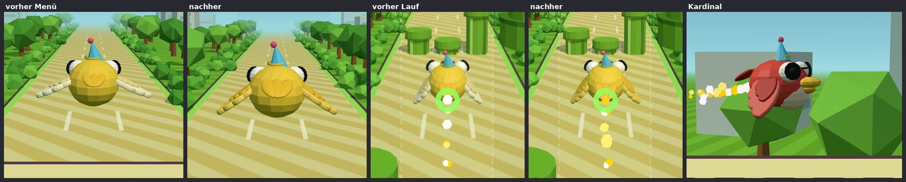

**Messwerte:**
- Playtest (`SEED=7`): identisch mit Iteration 15 (Anfänger 19,5 s, Geübt 38,8 s,
  Profi 142 Punkte).
- Spitzenwert: 160 Draw Calls, 56 k Dreiecke.
- APK baut.

### Iteration 17 – Fließtext in Fredoka SemiBold (Bereich 6)

**Was:**
- Alle Fließtexte (Missionen, Erfolge, Shop-Tabs, Hinweise, Datenschutz-Link) nutzen jetzt
  Fredoka SemiBold statt der Systemschrift. Die Titel bleiben in Lilita One.
- Die Schrift ist lokal eingebettet (offline) und steht mit Lizenz (OFL 1.1) in `docs/ASSETS.md`.
- Missions- und Erfolgstexte sind 1 px größer, weil Fredoka kleiner läuft.

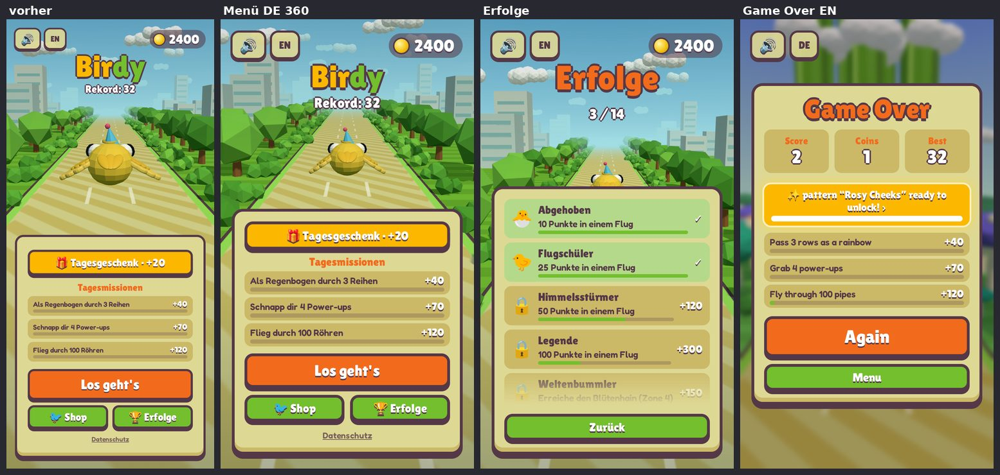

**Messwerte:**
- Playtest (`SEED=7`): identisch mit Iteration 16 (Anfänger 19,5 s, Geübt 38,8 s, Profi 142 Punkte).
- Keine Änderung an der 3D-Szene, also auch keine an Draw Calls und Dreiecken.
- APK baut.

### Iteration 18 – eigene Abzeichen-Icons statt Emoji (Bereich 6, Variante C)

**Was:**
- Alle Emoji in der Oberfläche sind durch eigene SVG-Icons ersetzt: ein weißes Symbol auf einer
  farbigen runden Plakette mit Pflaumen-Rand (`src/icons.js`). Sie sehen auf jedem Handy gleich aus.
- Betroffen sind:
  - Shop-Reiter und Zufall-Würfel, Welt- und Upgrade-Kacheln
  - Erfolge und das Schloss für gesperrte Erfolge
  - die Häkchen bei erledigten Missionen und bei angelegten Artikeln
  - Tagesgeschenk, Serie, Überraschung, Toasts, Freischalt-Hinweis
  - Power-up-Chips im HUD, Ton-Knopf und die Tutorial-Hand
- Texte markieren Icons als `[name]`; `rich()`/`setRich()` machen daraus Inline-Icons in Textgröße.

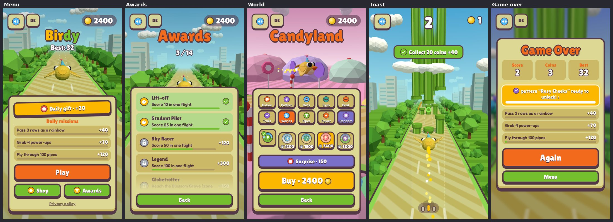

**Messwerte:**
- Playtest (`SEED=7`): identisch mit Iteration 17 (Anfänger 19,5 s, Geübt 38,8 s, Profi 142 Punkte),
  keine Fehler.
- Nur die Oberfläche hat sich geändert, die 3D-Szene nicht.
- APK baut.

### Iteration 19 – eigene Straßen- und Röhrenfarben pro Welt (Bereich 2, deine Wahl: überall A)

**Zur Auswahl:** [Varianten](visual/choice-worlds.jpg). Gewählt wurde:
- Winterland: Schnee und Eisblau
- Südsee: Sand mit türkisem Rand und türkise Röhren
- Zuckerland: Zuckerguss und Pink
- Pilzwald: Moos und Fliegenpilz-Rot

**Was:**
- Die Straßen-Textur wird aus einer Palette [Belag, Streifen, Rand] gemalt. Beim Zonenwechsel
  blendet sie in acht Schritten über, zum Beispiel zurück zum Sand im Herbstwald.
- Mit den klassischen Röhren bringt jede Welt ihre eigenen Röhrenfarben mit, für den ganzen Flug.
  Im Shop gekaufte Röhren-Designs gewinnen immer. Der Stadtpark bleibt Sand und Grün.

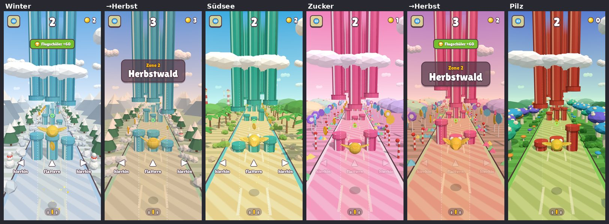

**Messwerte:**
- Playtest (`SEED=7`): identisch (Anfänger 19,5 s, Geübt 38,8 s, Profi 142 Punkte).
- Spitzenwert: 157 Draw Calls, 54 k Dreiecke.
- APK baut.

### Iteration 20 – seltene animierte Skins (neues Feature, deine Vorgaben)

**Was:**
- Sieben seltene Skins. Man kauft sie teuer mit Münzen oder bekommt sie gratis über einen eigenen
  schweren Erfolg:

  | Skin | Münzen | oder gratis durch |
  |---|---|---|
  | Fliegenpilz: weiße Punkte, die „atmen“ | 3000 | An 150 Stachelkakteen vorbei |
  | Basketball: Nähte, dreht sich | 3500 | 200 Runden gespielt |
  | Fußball: 12 Fünfecke, Sechsecke mit Nähten, rollt | 4000 | 100× „Knapp!“ insgesamt |
  | Wasser: wandernde Wellen, aufsteigende Luftblasen | 4500 | 5 Power-ups in einem Flug |
  | Lava: glühende Risse, die kriechen und pulsieren | 5000 | 10.000 Münzen eingesammelt |
  | Diamant: Facetten, Regenbogenschimmer, Funkeln, Lichtstreif | 5500 | 10× „Knapp!“ in Folge |
  | Galaxie: Nebel, wandernde funkelnde Sterne, Sternschnuppen | 6000 | 200 Punkte in einem Flug |
- Die Muster entstehen im Shader (`src/skinfx.js`) auf denselben Meshes und in denselben
  Draw Calls. Der Effekt-Shader wird nur kompiliert, wenn ein seltener Skin getragen wird.
- Shop: schimmernder Regenbogen-Rahmen, Etikett „Selten“ und eine bewegte Kachel. Darunter steht,
  mit welchem Erfolg es gratis geht. In den Erfolgen sind die sieben Erfolge hervorgehoben und
  nennen den Skin. Keine echten Käufe.

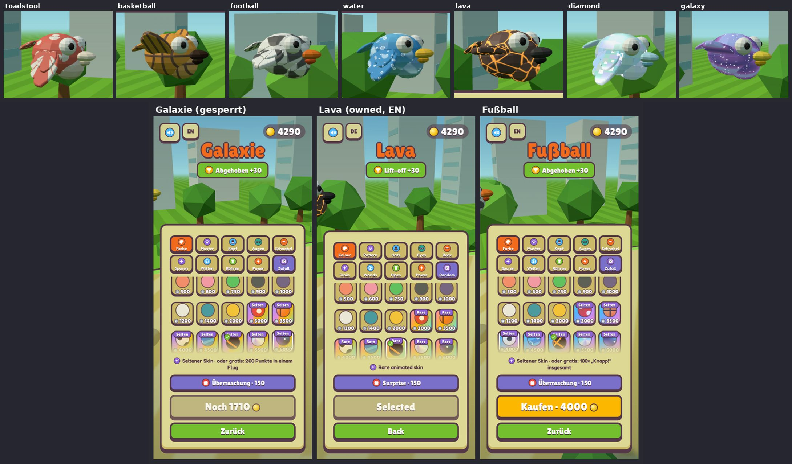

**Messwerte:**
- Playtest (`SEED=7`): identisch (Anfänger 19,5 s, Geübt 38,8 s, Profi 142 Punkte).
- Spitzenwert: 157 Draw Calls, 53 k Dreiecke.
- Erster Frame, direkt im Wechsel mit Iteration 19 gemessen: im Median rund 722 ms gegenüber
  rund 700 ms (+3 %, Budget 782 ms).
- APK baut.
